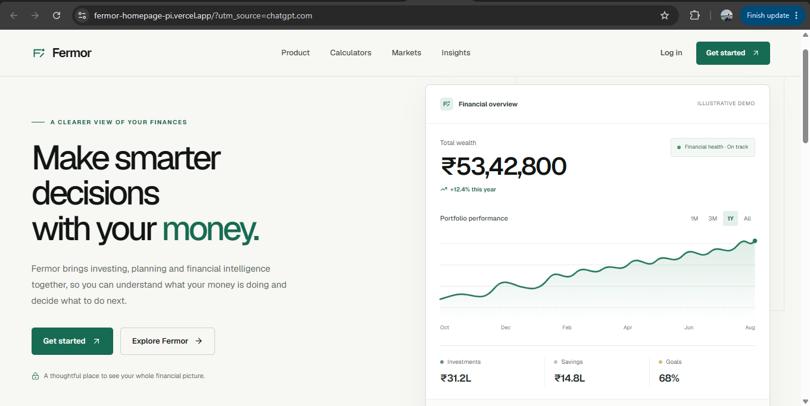
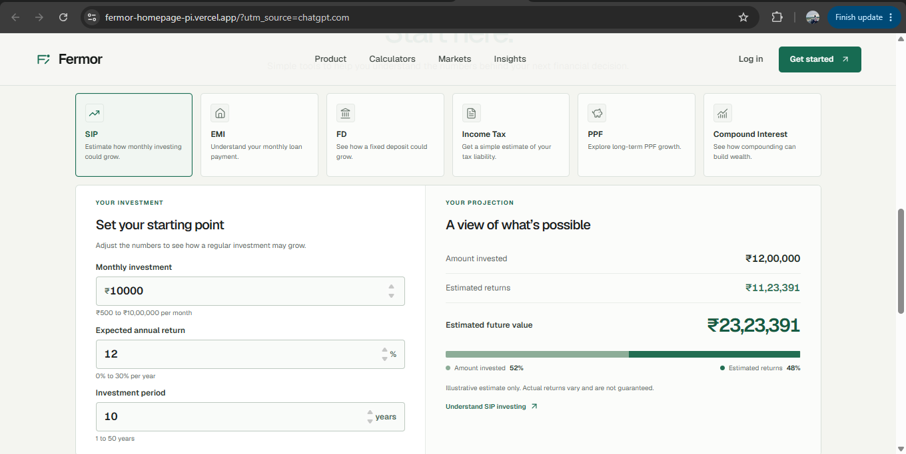
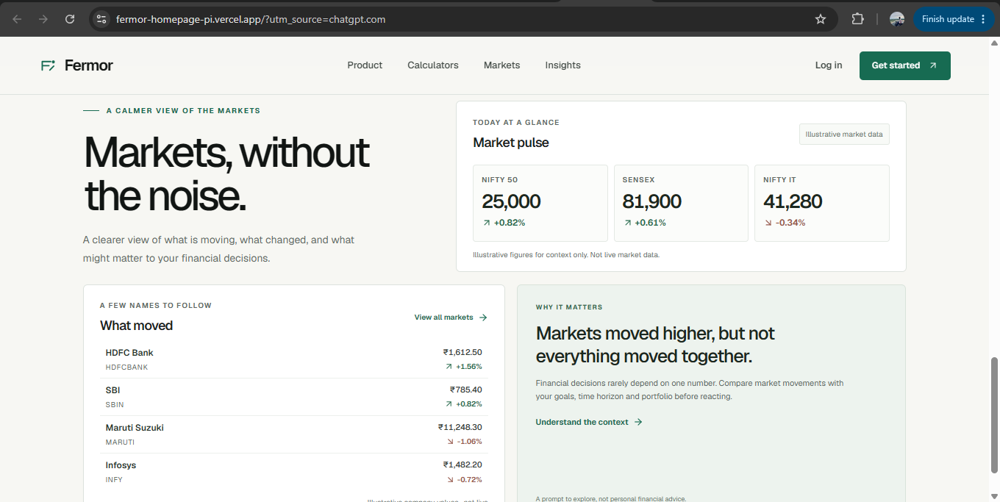

# Fermor Homepage

A responsive financial intelligence homepage built with Next.js and TypeScript. The project provides a clean interface for users to understand their finances, explore financial tools, calculate SIP projections, and view market information.

## Live Demo

🌐 **Live Website:**  
https://fermor-homepage-pi.vercel.app/

## GitHub Repository

🔗 **Repository:**  
https://github.com/bvhithesh012/Fermor-homepage

---

## Overview

Fermor is a responsive financial homepage designed to provide a simple and modern experience for exploring financial information.

The homepage includes:

- Hero section with primary calls to action
- Financial dashboard
- Financial tools
- SIP calculator
- Market intelligence section
- Market pulse and index information
- Responsive navigation
- Responsive layouts across mobile, tablet, and desktop

The interface is designed to remain usable and visually consistent across different screen sizes.

---

## Features

### 🏠 Hero Section

- Clear financial-focused headline
- Primary "Get Started" CTA
- Secondary exploration CTA
- Responsive layout for mobile and desktop

### 📊 Financial Dashboard

Provides a quick overview of financial information including:

- Portfolio-related information
- Market data
- Financial indicators
- Summary cards
- Portfolio performance visualization

### 🧮 SIP Calculator

The SIP calculator allows users to enter:

- Monthly investment
- Expected annual return
- Investment duration

The calculator provides:

- Estimated invested amount
- Estimated returns
- Projected total value

The calculations update dynamically based on the selected inputs.

### 📈 Market Intelligence

Includes market information such as:

- NIFTY 50
- SENSEX
- NIFTY IT
- Market movement
- Market pulse
- Selected stock information

> Market figures displayed in the application are illustrative data for demonstration purposes and are not intended to represent live financial market data.

### 🛠️ Financial Tools

The financial tools section provides quick access to different financial utilities, including:

- SIP
- EMI
- FD
- Income Tax
- PPF
- Compound Interest

The tool grid is responsive:

- **400px:** 2 columns
- **768px:** 3 columns
- **1024px+:** 6 columns

### 📱 Responsive Design

The application was tested across:

- 400 × 546
- 768 × 800
- 1024 × 800
- 1440 × 900

The layout was checked for:

- Horizontal overflow
- Content clipping
- Responsive navigation
- CTA alignment
- Calculator layout
- Market cards
- Tool grid responsiveness
- Sticky header behavior
- Anchor scrolling

---

## Screenshots

### Desktop Homepage



### Mobile Homepage


### SIP Calculator



### Market Intelligence



---

## Tech Stack

### Frontend

- Next.js
- React
- TypeScript
- CSS
- Responsive CSS
- Media Queries

### Development

- Node.js
- npm
- ESLint
- Git
- GitHub

### Deployment

- Vercel

---

## Project Structure

```text
fermor-homepage/
│
├── app/
│   ├── globals.css
│   ├── layout.tsx
│   └── page.tsx
│
├── components/
│   ├── FinancialDashboard.tsx
│   ├── FinancialTools.tsx
│   ├── Hero.tsx
│   ├── MarketIntelligence.tsx
│   ├── Navbar.tsx
│   └── SipCalculator.tsx
│
├── screenshots/
│   ├── homepage-desktop.png
│   ├── homepage-mobile.png
│   ├── markets.png
│   └── sip-calculator.png
│
├── public/
│
├── next.config.ts
├── package.json
├── package-lock.json
├── tsconfig.json
└── README.md